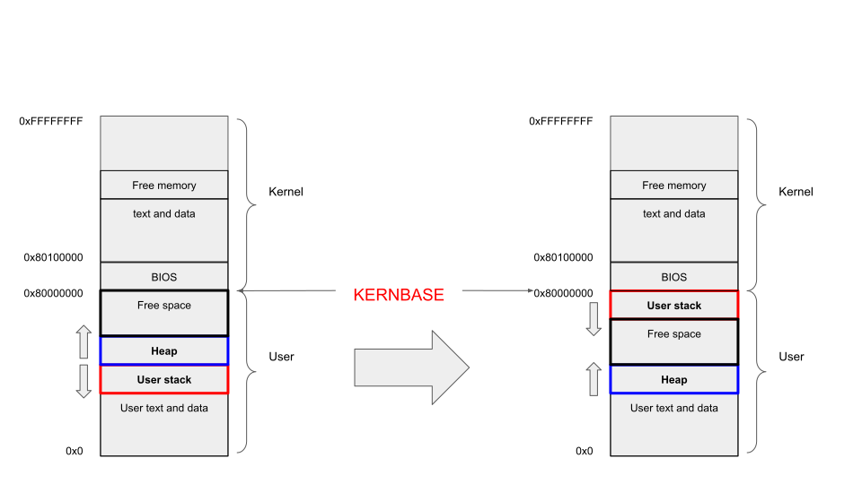

# Lab 3 - Memory

## Accept Your Assignment

[https://classroom.github.com/a/D7TkZLcL](https://classroom.github.com/a/D7TkZLcL)

**Due: Sunday, Mar 16th, 2025, 23:59, PST**

## Background

In this Lab, we would like modify the memory layout about stack and heap in xv6-riscv to make it become closer to Linux. Specifically, you will move the stack in xv6 and implement a dynamic grow strategy for it. 

> Note: unless we specify explicitly, all addresses in the instruction refer to virtual addresses. 

### Memory Layout



The original memory layout of xv6 is on the left. Above `0x80000000`, which is defined by `KERNBASE` constant is the kernel space memory and the one below it is user space memory. 

What we care about is the user space memory. For user space, the block at the very bottom stores the code and static data, which is from the binary file loaded, e.g., hello-world program. The size of this block is determined statically whenever you execute a program by the binary size. 

The other two parts are stack and heap, which is quite the same as you learned in you C/C++ class. In xv6, the allocation of stack is static as well. Specifically, the kernel will allocate two pages for stack in `exec()` system call. One page is for stack guard and another is for user stack. 

> See [here](https://en.wikipedia.org/wiki/Stack-based_memory_allocation) if you don't remember what stack memory is.

For stack guard, this memory will be marked as user-unreadable after mapped. Therefore, any attempt accessing this memory will trigger a page fault. The guard is below the user stack. 

```
|    HEAP  ^   | 
|--------------|
|              |
|  USER STACK  |
|   (1 Page)   |
|--------------|
|//////////////|
|//STACK GUARD/|
|///(1 Page)///|
|--------------|
|  TEXT & DATA |
|      ...     |
```

```c
int
exec(char *path, char **argv)
{
// ...
  p = myproc();
  uint64 oldsz = p->sz;

  // Allocate some pages at the next page boundary.
  // Make the first inaccessible as a stack guard.
  // Use the rest as the user stack.
  sz = PGROUNDUP(sz);
  uint64 sz1;
  if((sz1 = uvmalloc(pagetable, sz, sz + (USERSTACK+1)*PGSIZE, PTE_W)) == 0)
    goto bad;
  sz = sz1;
  uvmclear(pagetable, sz-(USERSTACK+1)*PGSIZE);
  sp = sz;
  stackbase = sp - USERSTACK*PGSIZE;

// ...
 bad:
  if(pagetable)
    proc_freepagetable(pagetable, sz);
  if(ip){
    iunlockput(ip);
    end_op();
  }
  return -1;
}
```

Above is the critical code for creating user stack and stack guard in `kernel/exec.c`. 

An every important function in this lab is `uvmalloc` standing for *user virtual memory alloc*. It's in `kernel/vm.c`. Even the comment for this function says, it will grow process from old sz to new sz, but the memory it allocated is not necessarily continuous. You can assume that this function is for creating PTEs and mapping the pages for a continuous memory space $[\text{oldsz}, \text{newsz})$. 

```c
// Allocate PTEs and physical memory to grow process from oldsz to
// newsz, which need not be page aligned.  Returns new size or 0 on error.
uint64
uvmalloc(pagetable_t pagetable, uint64 oldsz, uint64 newsz, int xperm)
{
  char *mem;
  uint64 a;

  if(newsz < oldsz)
    return oldsz;

  // (1)
  oldsz = PGROUNDUP(oldsz);
  for(a = oldsz; a < newsz; a += PGSIZE){
    // (2) 
    mem = kalloc();
    if(mem == 0){
      uvmdealloc(pagetable, a, oldsz);
      return 0;
    }
    memset(mem, 0, PGSIZE);
    // (3)
    if(mappages(pagetable, a, PGSIZE, (uint64)mem, PTE_R|PTE_U|xperm) != 0){
      kfree(mem);
      uvmdealloc(pagetable, a, oldsz);
      return 0;
    }
  }
  return newsz;
}
```
1. Page round up, alignment by PGSIZE. 
2. Allocate a single physical page. This function will return the physical address for the page allocated. 
3. This function create a mapping between virtual address `a` and physical address `mem`. This function will create necessary PTEs. 

The heap memory in xv6 is allocated dynamically. To figure out how this finishes, we need search from the user space `malloc`. 

In `umalloc.c`, function `malloc` uses a simple strategy for heap allocation-Kernighan & Ritchie Malloc. It's a malloc function based on free list. It works as followings:

1. Find a large enough node in the list.
2. If there is, split this block into two-one is for allocation and another is for free. 
3. If there isn't, acquire more memory from the kernel. 

In `malloc()`, the function for acquiring more memory is `morecore()` function. This function further calls `sbrk()` system call to allocate the memory. 

`sbrk` doesn't have its own implementation, it is implemented in `sys_sbrk()`. It calls `growproc()` in `kernel/proc.c` and `growproc()` uses `p->sz` as its indicator for mapping the memory pages. 

## Your Tasks

Your tasks in lab 3 is as described in [figure](#memory-layout). The original memory layout in xv6, which is in the left should be modified to the one in the right. The key difference is the location of stack. In the left, the stack is at the bottom of the memory space, which is just above the text and data segment. In the right, however, it should be moved to the top of the user space, adjacent to the `KERNBASE`. 

This modification brings an advantage, which is allowing the grow of stack. Currently, if you run a deep-recursive function or allocate a large buffer (> 1 page, 4KiB) on xv6, it will trigger the page fault because the stack size in xv6 is fixed to 1 page. Stack grow could enhance the flexibility and capability of xv6, which allows the kernel allocating more pages for stack in need. 

### Breakdown

1. Change the memory layout of xv6, move the stack from the bottom of user space to the top. 
   1. You should keep the stack guard. 
   2. The stack memory should just below the `KERNBASE`. 
2. Implement stack growth for xv6.
   1. Current default stack pages count is 1, which is defined by `USERSTACK` in `kernel/param.h` and the number of stack pages will never change. You should keep the default value when creating the initial stack for process in `exec()`.
   2. Your kernel need allocate extra pages when a page fault related to stack happens. 
   3. The maximum pages for stack is defined by `RLIMIT_STACK` in `kernel/param.h`. It's useful when you decide whether the page fault is related to stack. `RLIMIT_STACK` doesn't include the guard page. Both `USERSTACK` and `RLIMIT_STACK` are for user stack and exclude the guard page. 
3. One extra system call is needed: `stackpg()`.
   1. The system call need return the number of current process's user stack page. This number should ignore the guard page. 

## Step-by-Step Instructions

### System call

The system call is the easiest to get started with. You also need another field (variable) defined in `struct proc` for tracking the number of stack pages. 

----------------------

**Memory Layout**

### From `exec()`

The first thing is changing the stack allocation. Currently, as shown in `exec()`, `uvmalloc()` would alloc `sz` to `sz + (USERSTACK+1)*PGSIZE` as user stack and page guard, which causes the stack at the bottom of the user space (because sz is increasing from 0~ during the execution). 

### To `uvmcopy()`

The second is modifying `uvmcopy()`-the memory copy function happened in `fork()`. This function copies the memory when fork happens, but it only copies the memory from 0 to `sz`. Because our modified kernel doesn't inside this range anymore, we need change `uvmcopy()` function to copy the stack. 

```c
// Given a parent process's page table, copy
// its memory into a child's page table.
// Copies both the page table and the
// physical memory.
// returns 0 on success, -1 on failure.
// frees any allocated pages on failure.
int
uvmcopy(pagetable_t old, pagetable_t new, uint64 sz)
{
  pte_t *pte;
  uint64 pa, i;
  uint flags;
  char *mem;
  // (1)
  for(i = 0; i < sz; i += PGSIZE){
    if((pte = walk(old, i, 0)) == 0)
      panic("uvmcopy: pte should exist");
    if((*pte & PTE_V) == 0)
      panic("uvmcopy: page not present");
    pa = PTE2PA(*pte);
    flags = PTE_FLAGS(*pte);
    if((mem = kalloc()) == 0)
      goto err;
    memmove(mem, (char*)pa, PGSIZE);
    if(mappages(new, i, PGSIZE, (uint64)mem, flags) != 0){
      kfree(mem);
      goto err;
    }
  }
  return 0;

 err:
  uvmunmap(new, 0, i / PGSIZE, 1);
  return -1;
}
```
1. Copy from 0 to `sz`. 

### To `proc_freepagetable()`

`proc_freepagetable()` will free the page table of a process in `exit()` and `exec()`. It's obvious you need it in `exit()`. In `exec()`, because you copied the page table from the parent process, `exec()` should create a new page table for the incoming program. 

Current `proc_freepagetable()` only frees the memory from 0~`sz`. For the same reason, it doesn't contains our modified stack pages. 

### Fix Some Bugs

Another minor issue is the initial process. The initial process is special, defined in `userinit()` of `kernel/proc.c`. This function calls `uvmfirst()` to create its own memory. 

```c
// Load the user initcode into address 0 of pagetable,
// for the very first process.
// sz must be less than a page.
void
uvmfirst(pagetable_t pagetable, uchar *src, uint sz)
{
  char *mem;

  if(sz >= PGSIZE)
    panic("uvmfirst: more than a page");
  mem = kalloc();
  memset(mem, 0, PGSIZE);
  mappages(pagetable, 0, PGSIZE, (uint64)mem, PTE_W|PTE_R|PTE_X|PTE_U);
  memmove(mem, src, sz);
}
```

It only allocates single page for mapping the code stored in `initcode[]`. This is just a piece of code calling `exec(/init)` so that it doesn't allocate stack. If you freed the stack in `proc_freepagetable()`, you need to come up with a method handling this initial process. 

**Stack Growth**

The stack growth happens when a page fault is detected. The page fault is captured as an exception, therefore, trapped by `usertrap()` in `trap.c`. 

```c
//
// handle an interrupt, exception, or system call from user space.
// called from trampoline.S
//
void
usertrap(void)
{
  int which_dev = 0;

  if((r_sstatus() & SSTATUS_SPP) != 0)
    panic("usertrap: not from user mode");

  // send interrupts and exceptions to kerneltrap(),
  // since we're now in the kernel.
  w_stvec((uint64)kernelvec);

  struct proc *p = myproc();
  
  // save user program counter.
  p->trapframe->epc = r_sepc();
  
  if(r_scause() == 8){
    // system call
    // ...
  } else if((which_dev = devintr()) != 0){
    // ok
  } else {
    // (1)
    printf("usertrap(): unexpected scause 0x%lx pid=%d\n", r_scause(), p->pid);
    printf("            sepc=0x%lx stval=0x%lx\n", r_sepc(), r_stval());
    setkilled(p);
  }
  // ...
}
```
1. This is current fault handler of xv6, it just prints out an error and show you some details. 

To know whether this is a page fault, we need to check scause (supervisor cause register) value. 

scause value has two types-interrupt or exception, which are determined by the greatest bit of scause. If the greatest bit is 1, it's an interrupt; otherwise it's an exception. 

When it's an exception:

- **0** - Instruction Address Misaligned  
- **1** - Instruction Access Fault  
- **2** - Illegal Instruction  
- **3** - Breakpoint  
- **4** - Load Address Misaligned  
- **5** - Load Access Fault  
- **6** - Store/AMO Address Misaligned  
- **7** - Store/AMO Access Fault  
- **8** - Environment Call from U-mode  
- **9** - Environment Call from S-mode  
- **12** - Instruction Page Fault  
- **13** - Load Page Fault  
- **15** - Store/AMO Page Fault  

When it's an interrupt:

- **1** - Supervisor Software Interrupt  
- **5** - Supervisor Timer Interrupt  
- **9** - Supervisor External Interrupt 

What we care about, is the exception 13 and 15. They are load & store page fault, therefore they might be a page fault related to stack. To further check whether it's a stack page fault, we also need to check the address. 

The address attempted to write to is stored in `stval()` register. The distance between this address and `KERNBASE` should be less or equal to `PGSIZE * RLIMIT_STACK` to be considered as a stack page fault. 

For a stack page fault, you need to allocate more pages as need to make the program running normally instead of exiting with page fault exception. 

## Grading Policy

10 pts in total:

1. 2 pts for the attendance. 
2. 8 pts for the Lab code (as shown in the autograder). If you don't have a report submitted, your grade for the code will receive a 50% penalty. 

We reserve the rights to grade your Lab according to your report in any situation. You can make a request for grading your Lab just according to your report if you cannot submit a runnable code. But we can't ensure we will give you any grade. 

We may also grade your assignment just according to your report (which means we will give up your grade in autograder) if we find any **SENSITIVE** code in your work or we find some unmatched performance for you between the labs and lectures. To avoid this case, understand and following the instruction well, write the code by yourself and never share your code with others. 

## What to write in report

We don't expect a very detailed report. Keep it in 2-3 pages. You don't need to copy, paste and explain your code in the report, as we can find them in your repo. 

Instead, you need to explain

1. Which files you modified and the reason for the modification. 
2. Is there any difficulty you met and how do you solve them.
3. For now, the `malloc()` system call uses a very naive way for managing heap memory. What's its advantage and disadvantage. Which one is a better replacement to it?
4. For the stack page field you added in lab, which lock do you need to hold before accessing it and why?

You can add other things in the report as well if you like. 

## Test Program

```c
#include "kernel/types.h"
#include "user.h"

char *token = "0dcd7249a5ad65f479a1b66c5cc603d8";

unsigned int seed = 1;
unsigned int mod = (int)1e9 + 7;

void srand(unsigned int x) {
    seed = x;
}

unsigned int lcg_rand(void) {
    seed = (1103515245 * seed + 107) % mod;
    return seed;
}

int test_layout() {
    int stack_var = lcg_rand();
    int *heap_ptr = malloc(sizeof(int));
    *heap_ptr = stack_var;

    if (stack_var != *heap_ptr) {
        printf("[test_layout] stack_var should be equal to heap_var, however got [stack_var: %x] \\neq [heap_var: %x]", stack_var, *heap_ptr);
        return 1;
    }

    if (&stack_var < heap_ptr) {
        printf("[test_layout] stack should be above heap however got stack_ptr=%p < heap_ptr=%p", &stack_var, heap_ptr);
        return 1;
    }

    printf("[test_layout] %s\n", token);
    printf("[test_layout] PASSED\n");
    return 0;
}

int test_stack_copy_in_fork() {
    int pid;
    if (!(pid = fork())) {
        int stack_var = lcg_rand();
        return stack_var;
    }
    int retval;
    if (wait(&retval) != pid) {
        printf("[test_stack_copy_in_fork] fork & wait failed\n");
        return 1;
    }
    printf("[test_stack_copy_in_fork] %s\n", token);
    printf("[test_stack_copy_in_fork] PASSED\n");
    return 0;
}

int fib[1024];

int fibonacci(int x) {
    if (fib[x]) return fib[x];
    return fib[x] = x < 2 ? x : (fibonacci(x - 1) + fibonacci(x - 2)) % mod;
}

int test_grow_with_recursion() {
    int fib_1000 = fibonacci(1000);
    if (fib_1000 != 517691607) {
        printf("[test_grow_with_recursion] expected fib(1000) = 517691607, however got fib(1000) = %d\n", fib_1000);
        return 1;
    }
    printf("[test_grow_with_recursion] %s\n", token);
    printf("[test_grow_with_recursion] PASSED\n");
    return 0;
}

int test_grow_with_large_stack_buffer() {
    printf("[test_grow_with_large_stack_buffer] allocating 8 * 4 KiB (8 pages) stack buffer\n");
    char stack_buf[8<<12];
    printf("[test_grow_with_large_stack_buffer] stack buffer allocated: %p\n", stack_buf);
    for (int i = 0; i < sizeof(stack_buf); ++i) {
        stack_buf[i] = lcg_rand();
        if (i < 10) printf("%d ", stack_buf[i]);
    }
        
    printf("\n");
    int sum = 0;
    for (int i = 0; i < sizeof(stack_buf); ++i)
        sum += stack_buf[i];
    printf("[test_grow_with_large_stack_buffer] sum of stack buffer: %d\n", sum);
    printf("[test_grow_with_large_stack_buffer] %s\n", token);
    printf("[test_grow_with_large_stack_buffer] PASSED\n");
    return 0;
}

int large_buffer() {
    // out of rlimit
    volatile char buf[1<<20];
    buf[0] = 0;
    return buf[0];
}

int test_grow_out_of_limit() {
    if (!fork()) return large_buffer();
    int status;
    wait(&status);
    if (status != -1) {
        printf("[test_grow_out_of_limit] expected status = -1, however got status = %d\n", status);
        return 1;
    }
    printf("[test_grow_out_of_limit] %s\n", token);
    printf("[test_grow_out_of_limit] PASSED\n");
    return 0;
}

int precheck_page_grow(int pages) {
    volatile char buf[pages << 12];
    printf("[precheck_page_grow] allocated %d pages stack buffer: %p\n", pages, buf);
    if (stackpg() != pages+1) {
        printf("[precheck_page_grow] stackpg() should return %d, however got %d\n", pages+1, stackpg());
        return 1;
    }
    return 0;
}

int test_precheck() {
    // check system call
    if (stackpg() != 1) {
        printf("[test_precheck] stackpg() should return 1 for start-up process, however got %d\n", stackpg());
        return 1;
    }
    int pages = lcg_rand() % 128;
    for (int i = 1; i < pages; i += (lcg_rand() % 3 + 1)) 
        if (precheck_page_grow(i))
            return 1;
    printf("[test_precheck] %s\n", token);
    printf("[test_precheck] PASSED\n");
    return 0;
}

int (*tests[])(void) = {
    test_precheck,
    test_layout,
    test_stack_copy_in_fork,
    test_grow_with_recursion,
    test_grow_with_large_stack_buffer,
    test_grow_out_of_limit,
};

int all_tests() {
    for (int i = 0; i < sizeof(tests) / sizeof(tests[0]); ++i)
        if (tests[i]()) return 1;
    return 0;
}

int main(int argc, char **argv) {
    srand(uptime());
    if (argc > 1) return tests[atoi(argv[1])]();
    else return all_tests();
}

```