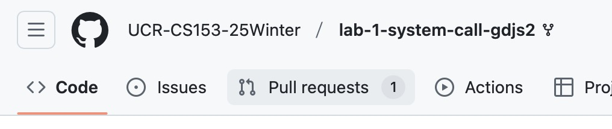

# Github Classroom Pull Request

Some times you may see pull request on your Github Repo. This is due to my change of the start code of your lab. 

For most of time, it's that I updated the autograder. In order that you can see your correct grades (even though it wouldn't affect your final lab grades) on time, it's better for you to merge my pull request before you start your work. 

If you have started/commited your work, it's fine to merge it as the files changed are usually the files related to autograder, which wouldn't affect your code of xv6.

For accepting the pr:

1. Click on the Pull Request button on the top of your repo. 
2. Click on the pull request you want to merge (typically named by *GitHub Classroom: Sync Assignment*). 
3. If there is no confilct, you can merge the pull request by click on the green button of *Merge Pull Request* . If there is some conflicts, you may should solve the conflict by yourself first. You can contact me for help if there is conflict. 

